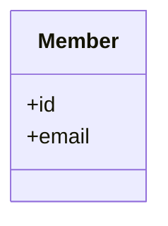

# Mermaid Publication Workflows

This document explains how Rupify Mermaid outputs should be generated, stored, and embedded in
GitHub and Confluence.

## Supported Mermaid Outputs

Rupify currently supports these Mermaid artifact families:

- `domain-mermaid` -> `domain-model.mmd`
- `interaction-mermaid` -> `interaction-model.mmd`
- `deployment-mermaid` -> `deployment-model.mmd`
- `state-mermaid` -> `state-model.mmd`

These outputs are generated from the canonical model through
`python -m specops_tools.render_cli --artifact-family ...`.

They are not hand-authored source artifacts. The canonical model remains the source of truth.

## Generation Pattern

Generate Mermaid outputs from a checked-in model:

```bash
uv run python -m specops_tools.render_cli \
  --model examples/it-systems-inventory/specops-model.json \
  --output-dir /tmp/specops-mermaid \
  --artifact-family domain-mermaid
```

Repeat with `interaction-mermaid`, `deployment-mermaid`, or `state-mermaid` as needed.

If the model comes from an interview fixture, first generate the normalized model or formal bundle
through the existing interview pipeline, then render Mermaid from that model rather than editing
diagram text directly.

## GitHub Embedding

GitHub renders Mermaid directly inside fenced code blocks.

Example:

````markdown

````

Recommended GitHub workflow:

- keep the generated `.mmd` file as the canonical diagram text output
- embed Mermaid blocks in documentation by copying the generated content into a fenced
  `mermaid` block
- when the model changes, regenerate the `.mmd` file and refresh any embedded copies

If duplicate maintenance becomes a problem, prefer linking to the generated `.mmd` file over
manually maintaining separate diagram text in multiple documents.

## Confluence Embedding

Confluence support depends on the site configuration. In practice, teams usually use either:

- a Mermaid macro or plugin that accepts Mermaid text directly
- a code block workflow where Mermaid text is copied into a supported macro

Recommended Confluence workflow:

- generate the `.mmd` file from the canonical model in the repo
- paste the generated Mermaid text into the Confluence Mermaid-compatible macro
- avoid editing the Confluence copy by hand unless the repo source is updated first

Confluence should be treated as a publishing surface, not the source of truth.

## Operational Rules

- do not hand-edit generated Mermaid outputs as the primary source
- do not bypass the canonical model by drawing diagrams directly in GitHub or Confluence
- regenerate Mermaid after model changes rather than patching the diagram text manually
- keep Mermaid publication subordinate to the model and artifact workflow already in the repo

## Practical Mapping

- `domain-model.mmd` uses Mermaid `classDiagram`
- `interaction-model.mmd` uses Mermaid `sequenceDiagram`
- `deployment-model.mmd` uses Mermaid `flowchart`
- `state-model.mmd` uses Mermaid `stateDiagram-v2`
